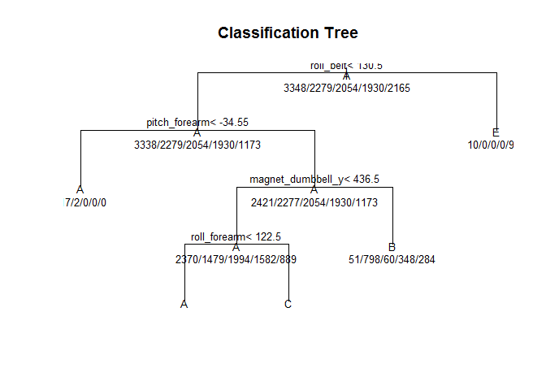
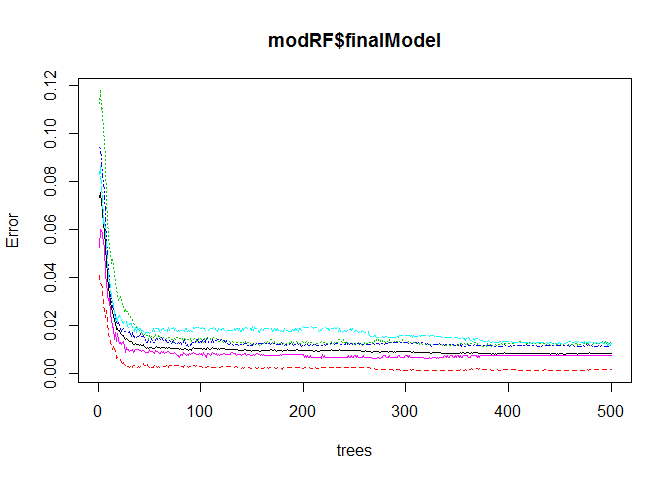

This is the original R-Script for direct access in GitHub. Additional HTML and Rmd files are provided in the repository.

# Practical Machine Learning - Course Project
Björn Fisseler  
April 2015  

Using devices such as Jawbone Up, Nike FuelBand, and Fitbit it is now possible to collect a large amount of data about personal activity relatively inexpensively. These type of devices are part of the quantified self movement – a group of enthusiasts who take measurements about themselves regularly to improve their health, to find patterns in their behavior, or because they are tech geeks. One thing that people regularly do is quantify how much of a particular activity they do, but they rarely quantify how well they do it. In this project, your goal will be to use data from accelerometers on the belt, forearm, arm, and dumbell of 6 participants. They were asked to perform barbell lifts correctly and incorrectly in 5 different ways. More information is available from the website here: http://groupware.les.inf.puc-rio.br/har (see the section on the Weight Lifting Exercise Dataset). 

# Basic strategy

- import and clean the data
- split the data for cross-validation and out-of-sample error estimation
- build three prediction models using different classification algorithms with training data
- use each prediction model to predict the test data
- compare the three models using Accuracy as the out-of-sample-error measure
- predict the 20 test cases

# Data Import + Preparation

Data is loaded from the internet. As the data contains several variables with missing data or non-data, only the columns with no NA are kept. We also drop the first seven variables, as these contain timestamps and user information, which are not relevant to the actual machine learning.


```r
library(RCurl)
library(foreach)
#library(dplyr)
library(caret)

set.seed(1234)
# load the data
trainingData <- read.csv(text=getURL("https://d396qusza40orc.cloudfront.net/predmachlearn/pml-training.csv" , .opts = list(ssl.verifypeer = FALSE)), na.strings=c("NA","#DIV/0!", ""), stringsAsFactors = FALSE)

trainingData <- trainingData[,-c(1:7)]
trainingData <- trainingData[,colSums(is.na(trainingData)) == 0]
t <- nearZeroVar(trainingData, saveMetrics = TRUE)
trainingData <- trainingData[, t$nzv == FALSE]
trainingData$classe <- factor(trainingData$classe)

testingData <- read.csv(text=getURL("https://d396qusza40orc.cloudfront.net/predmachlearn/pml-testing.csv" , .opts = list(ssl.verifypeer = FALSE)), na.strings=c("NA","#DIV/0!", ""), stringsAsFactors = FALSE)

testingData <- testingData[,-c(1:7)]
testingData <- testingData[,colSums(is.na(testingData)) == 0]
t <- nearZeroVar(testingData, saveMetrics = TRUE)
testingData <- testingData[, t$nzv == FALSE]
```

# Example of feature plot

We just do a small feature plot for fun.


```r
featurePlot(x = trainingData[, c(1:3)], y = trainingData$classe, plot = "pairs")
```

 

# Split the data for cross validation

We split the data into training and testing data (60%/40%). Additionally each model is build using five-fold cross-validation.


```r
inTrain <- createDataPartition(trainingData$classe, p=.60, list=FALSE)

trainTrain <- trainingData[inTrain,]
testTrain <- trainingData[-inTrain,]
```

# Build first model: Decision Tree with J48

First model is a decision tree, build using J48.


```r
modJ48 <- train(classe ~ ., data = trainTrain, method = 'J48', trControl=trainControl(method="cv", number=5, repeats=2))
print(modJ48)
```

```
## C4.5-like Trees 
## 
## 11776 samples
##    52 predictor
##     5 classes: 'A', 'B', 'C', 'D', 'E' 
## 
## No pre-processing
## Resampling: Cross-Validated (5 fold) 
## 
## Summary of sample sizes: 9422, 9420, 9421, 9420, 9421 
## 
## Resampling results
## 
##   Accuracy  Kappa      Accuracy SD  Kappa SD   
##   0.939539  0.9235233  0.006798985  0.008589799
## 
## Tuning parameter 'C' was held constant at a value of 0.25
## 
```

```r
pred.J48 <- predict(modJ48, testTrain)
cm.J48 <- confusionMatrix(pred.J48, testTrain$classe)
print(cm.J48)
```

```
## Confusion Matrix and Statistics
## 
##           Reference
## Prediction    A    B    C    D    E
##          A 2172   47   14    4    7
##          B   23 1400   39   15   12
##          C   10   44 1264   25   10
##          D   21   11   39 1229   18
##          E    6   16   12   13 1395
## 
## Overall Statistics
##                                           
##                Accuracy : 0.9508          
##                  95% CI : (0.9458, 0.9555)
##     No Information Rate : 0.2845          
##     P-Value [Acc > NIR] : < 2.2e-16       
##                                           
##                   Kappa : 0.9378          
##  Mcnemar's Test P-Value : 0.003646        
## 
## Statistics by Class:
## 
##                      Class: A Class: B Class: C Class: D Class: E
## Sensitivity            0.9731   0.9223   0.9240   0.9557   0.9674
## Specificity            0.9872   0.9859   0.9863   0.9864   0.9927
## Pos Pred Value         0.9679   0.9402   0.9342   0.9325   0.9674
## Neg Pred Value         0.9893   0.9814   0.9840   0.9913   0.9927
## Prevalence             0.2845   0.1935   0.1744   0.1639   0.1838
## Detection Rate         0.2768   0.1784   0.1611   0.1566   0.1778
## Detection Prevalence   0.2860   0.1898   0.1724   0.1680   0.1838
## Balanced Accuracy      0.9801   0.9541   0.9551   0.9711   0.9800
```

# Build second model: Classification Trees

The second model is a classification tree.


```r
modRPart <- train(classe ~ ., data = trainTrain, method = 'rpart', trControl=trainControl(method="cv", number=5, repeats=2))
print(modRPart)
```

```
## CART 
## 
## 11776 samples
##    52 predictor
##     5 classes: 'A', 'B', 'C', 'D', 'E' 
## 
## No pre-processing
## Resampling: Cross-Validated (5 fold) 
## 
## Summary of sample sizes: 9420, 9421, 9421, 9420, 9422 
## 
## Resampling results across tuning parameters:
## 
##   cp          Accuracy   Kappa       Accuracy SD  Kappa SD  
##   0.03618889  0.5202060  0.37840251  0.02355978   0.04028965
##   0.06110584  0.4426868  0.25324765  0.06873558   0.11583407
##   0.11651637  0.3329625  0.07422192  0.04444301   0.06776939
## 
## Accuracy was used to select the optimal model using  the largest value.
## The final value used for the model was cp = 0.03618889.
```

```r
plot(modRPart$finalModel, uniform=TRUE, main = "Classification Tree")
text(modRPart$finalModel, use.n=TRUE, all=TRUE, cex=.8)
```

 

```r
pred.RPart <- predict(modRPart, testTrain)
cm.RPart <- confusionMatrix(pred.RPart, testTrain$classe)
print(cm.RPart)
```

```
## Confusion Matrix and Statistics
## 
##           Reference
## Prediction    A    B    C    D    E
##          A 2029  638  644  567  209
##          B   44  505   49  232  211
##          C  155  375  675  487  383
##          D    0    0    0    0    0
##          E    4    0    0    0  639
## 
## Overall Statistics
##                                           
##                Accuracy : 0.4904          
##                  95% CI : (0.4793, 0.5016)
##     No Information Rate : 0.2845          
##     P-Value [Acc > NIR] : < 2.2e-16       
##                                           
##                   Kappa : 0.3339          
##  Mcnemar's Test P-Value : NA              
## 
## Statistics by Class:
## 
##                      Class: A Class: B Class: C Class: D Class: E
## Sensitivity            0.9091  0.33267  0.49342   0.0000  0.44313
## Specificity            0.6334  0.91530  0.78388   1.0000  0.99938
## Pos Pred Value         0.4965  0.48511  0.32530      NaN  0.99378
## Neg Pred Value         0.9460  0.85114  0.87992   0.8361  0.88852
## Prevalence             0.2845  0.19347  0.17436   0.1639  0.18379
## Detection Rate         0.2586  0.06436  0.08603   0.0000  0.08144
## Detection Prevalence   0.5209  0.13268  0.26447   0.0000  0.08195
## Balanced Accuracy      0.7712  0.62399  0.63865   0.5000  0.72125
```

# Build third model: Random Forest

And Random Forest is used for the third model. As RF takes quite some time to compute, the execution is parallelized.


```r
#library(doMC)
#registerDoMC(cores = 3) #speed up things on multicore
library(doParallel)
cl <- makeCluster(2) #(detectCores())
registerDoParallel(cl)

modRF <- train(classe ~ ., data = trainTrain, method = 'rf', trControl=trainControl(method="cv", number=5, repeats=2), prox=TRUE,allowParallel=TRUE)
stopCluster(cl)
stopImplicitCluster()
registerDoSEQ()
gc()
```

```
##             used   (Mb) gc trigger   (Mb)  max used   (Mb)
## Ncells   1732817   92.6    2637877  140.9   2637877  140.9
## Vcells 152436324 1163.0  464690064 3545.4 499132741 3808.1
```

```r
plot(modRF$finalModel)
```

 

```r
pred.RF <- predict(modRF, testTrain)
cm.RF <- confusionMatrix(pred.RF, testTrain$classe)
print(cm.RF)
```

```
## Confusion Matrix and Statistics
## 
##           Reference
## Prediction    A    B    C    D    E
##          A 2231   18    0    0    0
##          B    0 1495   11    1    1
##          C    1    5 1347   21    2
##          D    0    0   10 1262    5
##          E    0    0    0    2 1434
## 
## Overall Statistics
##                                           
##                Accuracy : 0.9902          
##                  95% CI : (0.9877, 0.9922)
##     No Information Rate : 0.2845          
##     P-Value [Acc > NIR] : < 2.2e-16       
##                                           
##                   Kappa : 0.9876          
##  Mcnemar's Test P-Value : NA              
## 
## Statistics by Class:
## 
##                      Class: A Class: B Class: C Class: D Class: E
## Sensitivity            0.9996   0.9848   0.9846   0.9813   0.9945
## Specificity            0.9968   0.9979   0.9955   0.9977   0.9997
## Pos Pred Value         0.9920   0.9914   0.9789   0.9883   0.9986
## Neg Pred Value         0.9998   0.9964   0.9968   0.9963   0.9988
## Prevalence             0.2845   0.1935   0.1744   0.1639   0.1838
## Detection Rate         0.2843   0.1905   0.1717   0.1608   0.1828
## Detection Prevalence   0.2866   0.1922   0.1754   0.1628   0.1830
## Balanced Accuracy      0.9982   0.9914   0.9901   0.9895   0.9971
```

```r
detach("package:doParallel", unload=TRUE)
```

# Model Selection based on Out-of-Sample-Error

We use *Accuracy* as the the OoS-Error-Measure. Accuracy is defined as "the proportion of true results (both true positives and true negatives) among the total number of cases examined." (Wikipedia, URL: https://en.wikipedia.org/wiki/Accuracy_and_precision#In_binary_classification)

- Decision Tree: 0.9508
- Classification Tree: 0.4904
- Random Forest: 0.9912

# Predict

The best ML model is build using Random Forest (Accurary: 0.99, Kappa: 0.99). Therefor the prediction of the testing data is done using the model build with RF.


```r
pred.testing <- predict(modRF, testingData)
print(pred.testing)
```

```
##  [1] B A B A A E D B A A B C B A E E A B B B
## Levels: A B C D E
```
